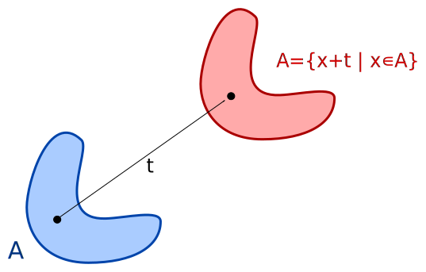
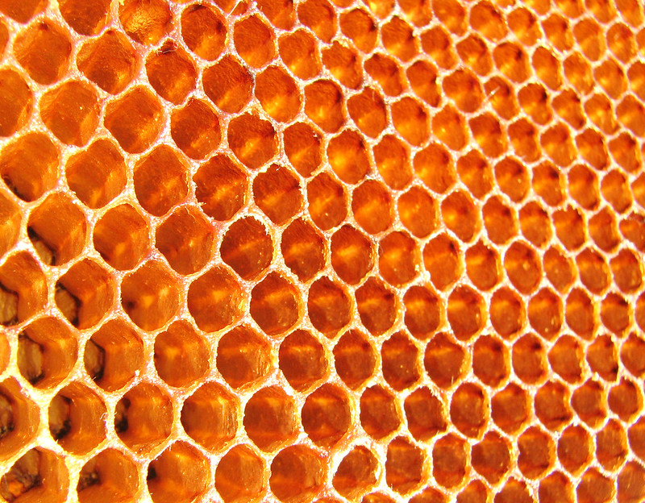
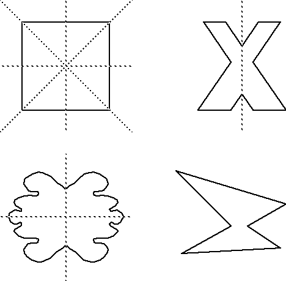
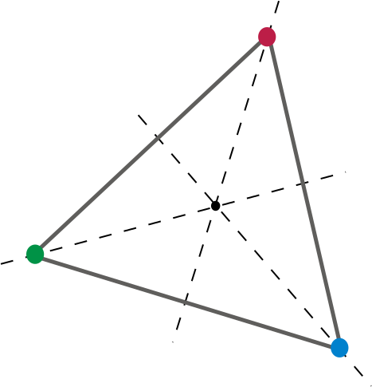
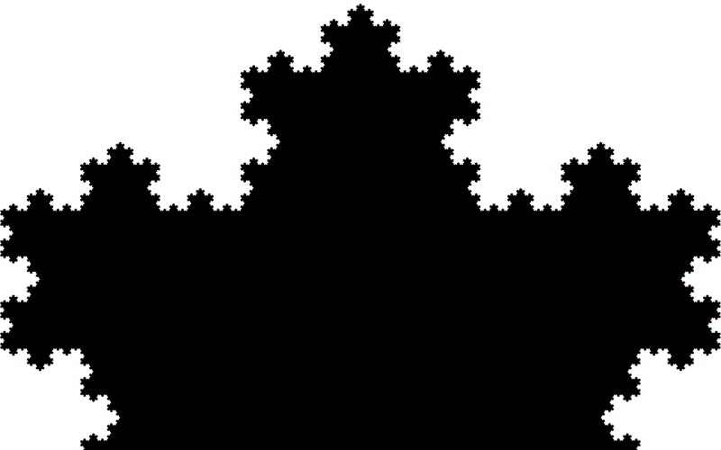

# What Are Fractals?!

### Simetries

First, we got to know how symmetry happens on nature. Then we can understand the new kind of symmetry that fractals exhibit.

1. \*\*\*\*[**Translational**](https://en.wikipedia.org/wiki/Translational_symmetry)\*\*\*\*

  

In geometry, to translate a geometric figure is to move it from one place to another without rotating it. A translation 'slides' a set A by adding x to every thing in A.

1. \*\*\*\*[**Reflection**](https://en.wikipedia.org/wiki/Reflection_symmetry)\*\*\*\*

  

A figure which does not change upon undergoing a reflection has reflectional symmetry.

In 2D there is a line/axis of symmetry, in 3D, a plane of symmetry. An object or figure which is indistinguishable from its transformed image is called mirror symmetric. In conclusion, a line of symmetry splits the shape in half and those halves should be identical.

1. \*\*\*\*[**Rotational**](https://en.wikipedia.org/wiki/Rotational_symmetry)\*\*\*\*

  

Rotational symmetry, also known as radial symmetry in biology, is the property a shape has when it looks the same after some rotation by a partial turn.

### Fractals structures

1. \*\*\*\*[**Self-Similarity**](https://en.wikipedia.org/wiki/Self-similarity)\*\*\*\*

A self-similar object is exactly or approximately similar to a part of itself. Self-similarity is one of the most common property of fractals. This feature is usually associated to [scale invariance](https://en.wikipedia.org/wiki/Scale_invariance). The parts are similar to the whole.

## References

* [https://en.wikipedia.org/wiki/Fractal](https://en.wikipedia.org/wiki/Fractal)
* [https://en.wikipedia.org/wiki/Translational\_symmetry](https://en.wikipedia.org/wiki/Translational_symmetry)
* [https://en.wikipedia.org/wiki/Reflection\_symmetry](https://en.wikipedia.org/wiki/Reflection_symmetry)
* [https://en.wikipedia.org/wiki/Rotational\_symmetry](https://en.wikipedia.org/wiki/Rotational_symmetry)
* [https://en.wikipedia.org/wiki/Self-similarity](https://en.wikipedia.org/wiki/Self-similarity)

